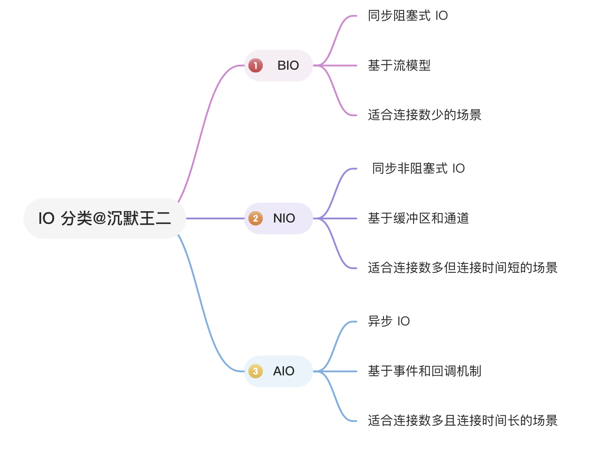
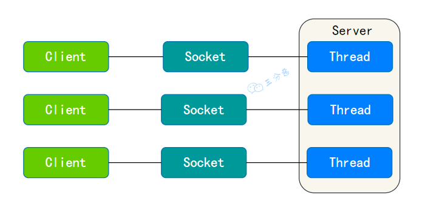
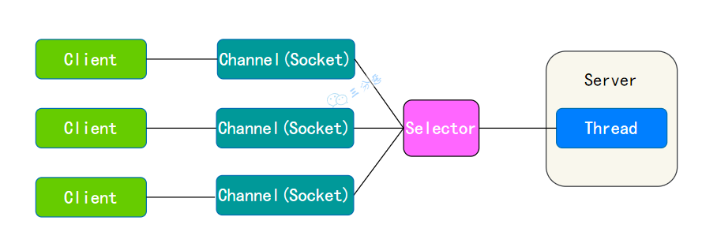

## Java 中 IO 流分为几种?
Java IO 流的划分可以根据多个维度进行，包括数据流的方向（输入或输出）、处理的数据单位（字节或字符）、流的功能以及流是否支持随机访问等。
## ==BIO、NIO、AIO 之间的区别==
Java 常见的 IO 模型有三种：BIO、NIO 和 AIO。

BIO：采用阻塞式 I/O 模型，线程在执行 I/O 操作时被阻塞，无法处理其他任务，适用于连接数较少的场景。

NIO：采用非阻塞 I/O 模型，线程在等待 I/O 时可执行其他任务，通过 Selector 监控多个 Channel 上的事件，适用于连接数多但连接时间短的场景。

AIO：使用异步 I/O 模型，线程发起 I/O 请求后立即返回，当 I/O 操作完成时通过回调函数通知线程，适用于
### BIO

对于每个连接，都需要创建一个独立的线程来处理读写操作。
### NIO

NIO 的魅力主要体现在网络编程中，服务器可以用一个线程处理多个客户端连接，通过 Selector 监听多个 Channel 来实现多路复用，极大地提高了网络编程的性能。
### AIO
它引入了异步通道的概念，使得 I/O 操作可以异步进行。这意味着线程发起一个读写操作后不必等待其完成，可以立即进行其他任务，并且当读写操作真正完成时，线程会被异步地通知。