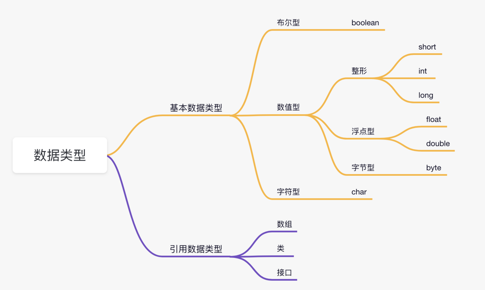
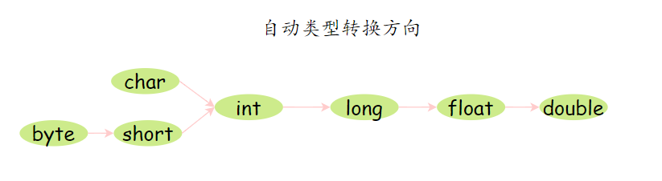

# Java数据类型

# 自动类型转换、强制类型转换

# 装箱和拆箱
- 装箱：将基本数据类型转换为包装类型，例如 int 转换为 Integer。
- 拆箱：将包装类型转换为基本数据类型。

# &和&&区别
& 是 逻辑与。

&&是短路与运算。逻辑与跟短路与的差别是非常大的，虽然二者都要求运算符左右两端的布尔值都是 true，整个表达式的值才是 true。

&&之所以称为短路运算是因为，如果&&左边的表达式的值是 false，右边的表达式会直接短路掉，不会进行运算。

# 数据准确性保证
在金融计算中，保证数据准确性有两种方案，一种使用 BigDecimal，一种将浮点数转换为整数 int 进行计算。
肯定不能使用 float 和 double 类型，它们无法避免浮点数运算中常见的精度问题，因为这些数据类型采用二进制浮点数来表示，无法准确地表示，例如 0.1。
