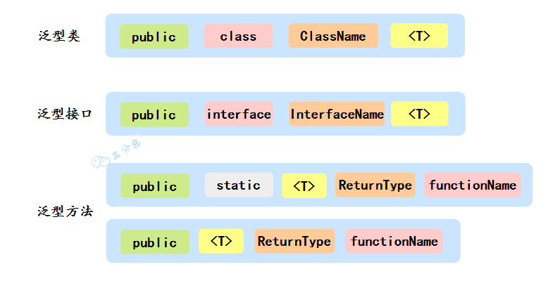

## Java 泛型了解么？
泛型主要用于提高代码的类型安全，它允许在定义类、接口和方法时使用类型参数，这样可以在编译时检查类型一致性，避免不必要的类型转换和类型错误。
泛型一般有三种使用方式:泛型类、泛型接口、泛型方法。

### 泛型类
```java
public class Generic<T> {
    private T key;
    
    public Generic(T key) {
        this.key = key;
    }
    public T getKey() {
        return this.key;
    }
}
Generic<Integer> generic = new Generic<Integer>(123333);
```
### 泛型接口
```java
public Inteface Generator<T> {
    public T method;
}
class GeneratorImpl<T> implements Generator<String> {
    @Override
    public String method() {
        return "a";
    }
}
```
### 泛型方法
```java
public static <E> void printArray(E[] inputArray) {
    for (E element:inputArray) {
         System.out.printf( "%s ", element );
    }
}
```
## 泛型常用的通配符有哪些？
常用的通配符为： T，E，K，V，？
？ 表示不确定的 java 类型
T (type) 表示具体的一个 java 类型
K V (key value) 分别代表 java 键值中的 Key Value
E (element) 代表 Element
## 什么是泛型擦除？
所谓的泛型擦除，官方名叫“类型擦除”。

Java 的泛型是伪泛型，这是因为 Java 在编译期间，所有的类型信息都会被擦掉。

也就是说，在运行的时候是没有泛型的。

例如这段代码，往一群猫里放条狗：
```java
LinkedList<Cat> cats = new LinkedList<Cat>();
LinkedList list = cats;  // 注意我在这里把范型去掉了，但是list和cats是同一个链表！
list.add(new Dog());  // 完全没问题！
```
因为 Java 的范型只存在于源码里，编译的时候给你静态地检查一下范型类型是否正确，而到了运行时就不检查了。
