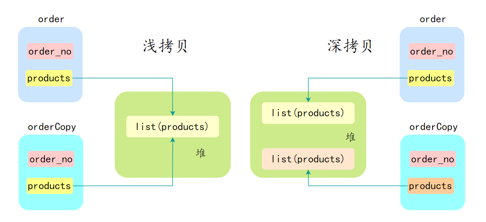
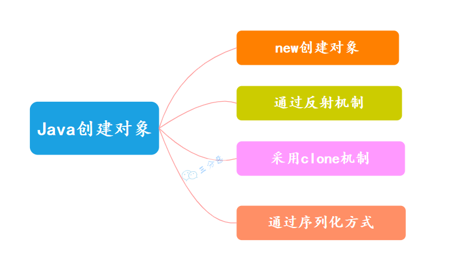

## ⾯向对象和⾯向过程的区别
面向过程是以过程为核心，通过函数完成任务，程序结构是函数+步骤组成的顺序流程。

面向对象是以对象为核心，通过对象交互完成任务，程序结构是类和对象组成的模块化结构，代码可以通过继承、组合、多态等方式复用

## ==面向对象编程有哪些特性？==
封装，继承和多态。
### 封装
封装是指将数据（属性，或者叫字段）和操作数据的方法（行为）捆绑在一起，形成一个独立的对象（类的实例）。
```java
class petter {
    private String name;
    private int age;
    public void setName(String name) {
        this.name = name;
    }

    public String getName() {
        return name;
    }

    public void setAge(int age) {
        this.age = age;
    }    
}
```
### 继承
继承允许一个类（子类）继承现有类（父类或者基类）的属性和方法。以提高代码的复用性，建立类之间的层次关系。

同时，子类还可以重写或者扩展从父类继承来的属性和方法，从而实现多态。
```java
class Person {
    protected String name;
    protected int age;

    public void eat() {
        System.out.println("吃饭");
    }
}

class Student extends Person {
    private String school;

    public void study() {
        System.out.println("学习");
    }
}
```
### 多态
多态允许不同类的对象对同一消息做出响应，但表现出不同的行为（即方法的多样性）。

多态其实是一种能力——同一个行为具有不同的表现形式；换句话说就是，执行一段代码，Java 在运行时能根据对象类型的不同产生不同的结果。

多态的前置条件有三个：

子类继承父类
子类重写父类的方法
父类引用指向子类的对象
#### 多态解决了什么问题？
多态指同一个接口或方法在不同的类中有不同的实现，比如说动态绑定，父类引用指向子类对象，方法的具体调用会延迟到运行时决定。
### 多态的具体实现
多态通过动态绑定实现，Java 使用虚方法表存储方法指针，方法调用时根据对象实际类型从虚方法表查找具体实现。
## ==重载和重写的区别==
如果一个类有多个名字相同但参数个数不同的方法，我们通常称这些方法为方法重载。
如果子类具有和父类一样的方法（参数相同、返回类型相同、方法名相同，但方法体不同），我们称之为方法重写
## 访问修饰符 public、private、protected、以及默认时的区别
- default （即默认，什么也不写）: 在同一包内可见，不使用任何修饰符。可以修饰在类、接口、变量、方法。
- private : 在同一类内可见。可以修饰变量、方法。注意：不能修饰类（外部类）
- public : 对所有类可见。可以修饰类、接口、变量、方法
- protected : 对同一包内的类和所有子类可见。可以修饰变量、方法。注意：不能修饰类（外部类）。
## 抽象类和接口有什么区别
一个类只能继承一个抽象类；但一个类可以实现多个接口。
### 抽象类和普通类的区别
抽象类使用 abstract 关键字定义，不能被实例化，只能作为其他类的父类。普通类没有 abstract 关键字，可以直接实例化。
抽象类可以包含抽象方法和非抽象方法。抽象方法没有方法体，必须由子类实现。普通类只能包含非抽象方法。
## 成员变量与局部变量的区别有哪些
- 从语法形式上看：成员变量是属于类的，⽽局部变量是在⽅法中定义的变量或是⽅法的参数；成员变量可以被 public , private , static 等修饰符所修饰，⽽局部变量不能被访问控制修饰符及 static 所修饰；但是，成员变量和局部变量都能被 final 所修饰。
- 从变量在内存中的存储⽅式来看：如果成员变量是使⽤ static 修饰的，那么这个成员变量是属于类的，如果没有使⽤ static 修饰，这个成员变量是属于实例的。对象存于堆内存，如果局部变量类型为基本数据类型，那么存储在栈内存，如果为引⽤数据类型，那存放的是指向堆内存对象的引⽤或者是指向常量池中的地址。
- 从变量在内存中的⽣存时间上看：成员变量是对象的⼀部分，它随着对象的创建⽽存在，⽽局部变量随着⽅法的调⽤⽽⾃动消失。
- 成员变量如果没有被赋初值：则会⾃动以类型的默认值⽽赋值（⼀种情况例外:被 final 修饰的成员变量也必须显式地赋值），⽽局部变量则不会⾃动赋值。
## static 关键字了解吗
static 关键字可以用来修饰变量、方法、代码块和内部类，以及导入包
静态变量和实例变量的区别？
静态变量: 是被 static 修饰符修饰的变量，也称为类变量，它属于类，不属于类的任何一个对象，一个类不管创建多少个对象，静态变量在内存中有且仅有一个副本。

实例变量: 必须依存于某一实例，需要先创建对象然后通过对象才能访问到它。静态变量可以实现让多个对象共享内存。

静态⽅法和实例⽅法有何不同?
类似地。

静态方法：static 修饰的方法，也被称为类方法。在外部调⽤静态⽅法时，可以使⽤"类名.⽅法名"的⽅式，也可以使⽤"对象名.⽅法名"的⽅式。静态方法里不能访问类的非静态成员变量和方法。

实例⽅法：依存于类的实例，需要使用"对象名.⽅法名"的⽅式调用；可以访问类的所有成员变量和方法。
## final、finally、finalize 的区别？
1、final 是一个修饰符，可以修饰类、方法和变量。当 final 修饰一个类时，表明这个类不能被继承；当 final 修饰一个方法时，表明这个方法不能被重写；当 final 修饰一个变量时，表明这个变量是个常量，一旦赋值后，就不能再被修改了。

2、finally 是 Java 中异常处理的一部分，用来创建 try 块后面的 finally 块。无论 try 块中的代码是否抛出异常，finally 块中的代码总是会被执行。通常，finally 块被用来释放资源，如关闭文件、数据库连接等。

3、finalize 是Object 类的一个方法，用于在垃圾回收器将对象从内存中清除出去之前做一些必要的清理工作。
## ==和 equals 的区别
== 比较引用，equals比较内容。
## ==为什么重写 equals 时必须重写 hashCode ⽅法？==
因为基于哈希的集合类（如 HashMap）需要基于这一点来正确存储和查找对象。

具体地说，HashMap 通过对象的哈希码将其存储在不同的“桶”中，当查找对象时，它需要使用 key 的哈希码来确定对象在哪个桶中，然后再通过 equals() 方法找到对应的对象。

如果重写了 equals()方法而没有重写 hashCode()方法，那么被认为相等的对象可能会有不同的哈希码，从而导致无法在 HashMap 中正确处理这些对象。
### 什么是 hashCode 方法？
hashCode() 方法的作⽤是获取哈希码，它会返回⼀个 int 整数，定义在 Object 类中， 是一个本地⽅法。
```java
public native int hashCode();
```
## hashCode 和 equals 方法的关系？
如果两个对象通过 equals 相等，它们的 hashCode 必须相等。否则会导致哈希表类数据结构（如 HashMap、HashSet）的行为异常。

在哈希表中，如果 equals 相等但 hashCode 不相等，哈希表可能无法正确处理这些对象，导致重复元素或键值冲突等问题。
## Java 是值传递，还是引用传递？
Java 是值传递，不是引用传递。

当一个对象被作为参数传递到方法中时，参数的值就是该对象的引用。引用的值是对象在堆中的地址。

对象是存储在堆中的，所以传递对象的时候，可以理解为把变量存储的对象地址给传递过去。
## 引用类型的变量有什么特点？
引用类型的变量存储的是对象的地址，而不是对象本身。因此，引用类型的变量在传递时，传递的是对象的地址，也就是说，传递的是引用的值。
## 说说深拷贝和浅拷贝的区别?
在 Java 中，深拷贝（Deep Copy）和浅拷贝（Shallow Copy）是两种拷贝对象的方式，它们在拷贝对象的方式上有很大不同。

浅拷贝会创建一个新对象，但这个新对象的属性（字段）和原对象的属性完全相同。如果属性是基本数据类型，拷贝的是基本数据类型的值；如果属性是引用类型，拷贝的是引用地址，因此新旧对象共享同一个引用对象。

浅拷贝的实现方式为：实现 Cloneable 接口并重写 clone() 方法。
```java
class Person implements Cloneable {
    String name;
    int age;
    Address address;

    public Person(String name, int age, Address address) {
        this.name = name;
        this.age = age;
        this.address = address;
    }

    @Override
    protected Object clone() throws CloneNotSupportedException {
        return super.clone();
    }
}

class Address {
    String city;

    public Address(String city) {
        this.city = city;
    }
}

public class Main {
    public static void main(String[] args) throws CloneNotSupportedException {
        Address address = new Address("dalian");
        Person person1 = new Person("hhh", 18, address);
        Person person2 = (Person) person1.clone();

        System.out.println(person1.address == person2.address); // true
    }
}
```
深拷贝也会创建一个新对象，但会递归地复制所有的引用对象，确保新对象和原对象完全独立。新对象与原对象的任何更改都不会相互影响。

深拷贝的实现方式有：手动复制所有的引用对象，或者使用序列化与反序列化。
## Java 创建对象有哪几种方式？

### new关键字
```java
Person person = new Person();
```
### 反射机制
```java
Class clasz = Class.forName({"Person"});
Person person clasz.newInstance();
```
### clone 拷贝
```java
Person person = new Person();
Person person1 = (Person) person.clone();
```java
### 序列化创建
通过序列化将对象转换为字节流，再通过反序列化从字节流中恢复对象。需要实现 Serializable 接口。
```java
Person person = new Person();
ObjectOutputStream oos = new ObjectOutputStream(new FileOutputStream(person.txt));
oos.writeObject(person);
ObjectInputStream ois = new ObjectInputStream(new FileInputStream("person.txt"));
Person person2 = (Person) ois.readObject();
```
## new 子类的时候，子类和父类静态代码块，构造方法的执行顺序
在 Java 中，当创建一个子类对象时，子类和父类的静态代码块、构造方法的执行顺序遵循一定的规则。这些规则主要包括以下几个步骤：

首先执行父类的静态代码块（仅在类第一次加载时执行）。
接着执行子类的静态代码块（仅在类第一次加载时执行）。
再执行父类的构造方法。
最后执行子类的构造方法。