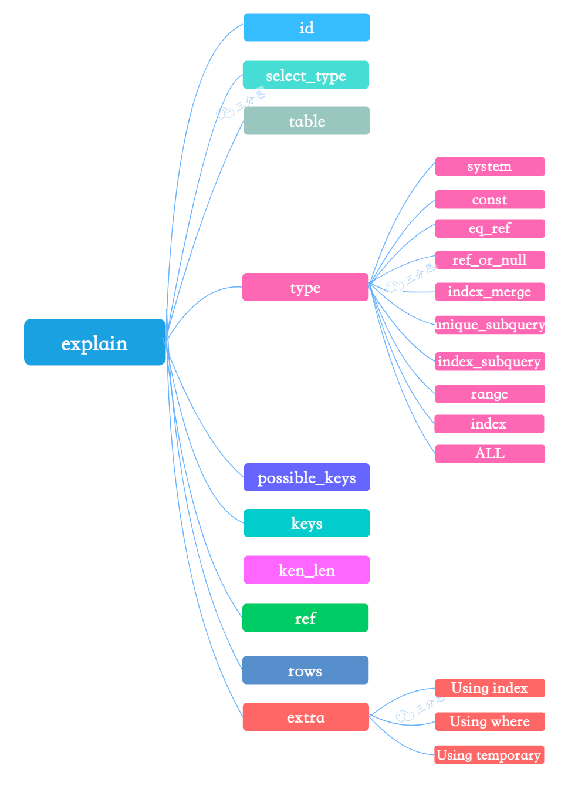

## 什么是慢 SQL
MySQL 中有一个叫 long_query_time 的参数，原则上执行时间超过该参数值的 SQL 就是慢 SQL，会被记录到慢查询日志中。
## SQL 的执行过程了解吗
连接管理，语法解析，语义解析，语义分析，查询优化，执行器调度，存储引擎读写。
## 如何优化慢 SQL 呢
查询慢SQL日志，分析结果，通过添加索引、优化查询条件、减少返回字段等方式进行优化。
## 慢sql日志怎么开启
编辑 MySQL 的配置文件 my.cnf，设置 slow_query_log 参数为 1。
```sql
[mysqld]
slow_query_log = 1
slow_query_log_file = /var/log/mysql/slow.log
long_query_time = 2  # 记录执行时间超过2秒的查询
```
## 你知道哪些方法来优化 SQL
SQL 优化的方法非常多，但本质上就一句话：尽可能少地扫描、尽快地返回结果。
## 如何利用覆盖索引
覆盖索引的核心是“查询所需的字段都在同一个索引里”，这样 MySQL 就不需要回表，直接从索引中返回结果。
实际使用中，我会优先考虑把 WHERE 和 SELECT 涉及的字段一起建联合索引，并通过 EXPLAIN 观察结果是否有 Using index，确认命中索引。
## 如何正确使用联合索引
使用联合索引最重要的一条是遵守最左前缀原则，也就是查询条件需要从索引的左侧字段开始。(最左侧字段必须用上)
## 如何进行分页优化
分页优化的核心是避免深度偏移带来的全表扫描，可以通过两种方式来优化：延迟关联和添加书签。

延迟关联适用于需要从多个表中获取数据且主表行数较多的情况。它首先从索引表中检索出需要的行 ID，然后再根据这些 ID 去关联其他的表获取详细信息。
```sql
SELECT e.id,e.name,d.details
FROM employee e
JOIN department d ON e.id=d.id
ORDER BY e,id
LIMIT 1000,20
```
延迟关联后，第一步只查主键，速度快，第二步只处理 20 条数据，效率高。
添加书签的方式是通过记住上一次查询返回的最后一行主键值，然后在下一次查询的时候从这个值开始，从而跳过偏移量计算，仅扫描目标数据，适合翻页、资讯流等场景。
假设需要对用户表进行分页。
```sql
SELECT id,name
FROM users
ORDER BY id
LIMIT 1000 20
```
通过添加书签来优化后，查询不再使用OFFSET，而是从上一页最后一个用户的 ID 开始查询。这种方法可以有效避免不必要的数据扫描，提高了分页查询的效率。
```sql
SELECT id,name
FROM users
WHERE id>last_max_id
ORDER BY id
LIMIT 20
```
## 为什么分页会变慢？
分页查询的效率问题主要是由于 OFFSET 的存在，OFFSET 会导致 MySQL 必须扫描和跳过 offset + limit 条数据，这个过程是非常耗时的。
## JOIN 代替子查询有什么好处？
第一，JOIN 的 ON 条件能更直接地触发索引，而子查询可能因嵌套导致索引失效。

第二，JOIN 的一次连接操作替代了子查询的多次重复执行，尤其在大数据量的情况下性能差异明显。
## JOIN操作为什么要小表驱动大表？
第一，如果大表的 JOIN 字段有索引，那么小表的每一行都可以通过索引快速匹配大表。
时间复杂度为小表行数 N 乘以大表索引查找复杂度 log(大表行数 M)，总复杂度为 N*log(M)。

显然小表做驱动表比大表做驱动表的时间复杂度 M*log(N) 更低。

第二，如果大表没有索引，需要将小表的数据加载到内存，再全表扫描大表进行匹配。
时间复杂度为小表分段数 K 乘以大表行数 M，其中 K = 小表行数 N / 内存大小 join_buffer_size。

当使用 left join 时，左表是驱动表，右表是被驱动表。
当使用 right join 时，刚好相反。
当使用 join 时，MySQL 会选择数据量比较小的表作为驱动表，大表作为被驱动表。
## 为什么要避免使用 JOIN 关联太多的表？
第一，多表 JOIN 的执行路径会随着表的数量呈现指数级增长，优化器需要估算所有路径的成本，有可能会导致出现大表驱动小表的情况。
第二，多表 JOIN 需要缓存中间结果集，可能超出 join_buffer_size，这种情况下内存临时表就会转为磁盘临时表，性能也会急剧下降。
## 如何进行排序优化？
第一，对 ORDER BY 涉及的字段创建索引，避免 filesort。
如果是多个字段，联合索引需要保证 ORDER BY 的列是索引的最左前缀。
第二，可以适当调整排序参数，如增大 sort_buffer_size、max_length_for_sort_data 等，让排序在内存中完成。
第三，可以通过 where 和 limit 限制待排序的数据量，减少排序的开销。
## 什么是 filesort？
当不能使用索引生成排序结果的时候，MySQL 需要自己进行排序，如果数据量比较小，会在内存中进行；如果数据量比较大就需要写临时文件到磁盘再排序，我们将这个过程称为文件排序。
## 全字段排序和 rowid 排序了解多少
当排序字段是索引字段且满足最左前缀原则时，MySQL 可以直接利用索引的有序性完成排序。
当无法使用索引排序时，MySQL 需要在内存或磁盘中进行排序操作，分为全字段排序和 rowid 排序两种算法。
全字段排序会一次性取出满足条件行的所有字段，然后在 sort buffer 中进行排序，排序后直接返回结果，无需回表
rowid 排序分为两个阶段：

第一阶段：根据查询条件取出排序字段和主键 ID，存入 sort buffer 进行排序；
第二阶段：根据排序后的主键 ID 回表取出其他需要的字段。
## 你对 Sort_merge_passes 参数了解吗？
Sort_merge_passes 是一个状态变量，用于统计 MySQL 在执行排序操作时进行归并排序的次数。

当 MySQL 需要进行排序但排序数据无法完全放入 sort_buffer_size 定义的内存缓冲区时，就会使用临时文件进行外部排序，这时就会产生 Sort_merge_passes。

如果 Sort_merge_passes 在短时间内快速激增，说明排序操作的数据量较大，需要调整 sort_buffer_size 或者优化查询语句。
## 条件下推你了解多少
条件下推的核心思想是将外层的过滤条件，比如说 where、join 等，尽可能地下推到查询计划的更底层，比如说子查询、连接操作之前，从而减少中间结果的数据量。
## 为什么要尽量避免使用 select *
SELECT * 会强制 MySQL 读取表中所有字段的数据，包括应用程序可能并不需要的，比如 text、blob 类型的大字段。

加载冗余数据会占用更多的缓存空间，从而挤占其他重要数据的缓存资源，降低整体系统的吞吐量。

也会增加网络传输的开销，尤其是在大字段的情况下。

最重要的是，SELECT * 可能会导致覆盖索引失效，本来可以走索引的查询最后变成了全表扫描。
## 你还知道哪些 SQL 优化方法
避免使用 != 或者 <> 操作符

!= 或者 <> 操作符会导致 MySQL 无法使用索引，从而导致全表扫描。
使用前缀索引

比如，邮箱的后缀一般都是固定的@xxx.com，那么类似这种后面几位为固定值的字段就非常适合定义为前缀索引：
```sql
alter table test add index index2(email(6));
```
需要注意的是，MySQL 无法利用前缀索引做 order by 和 group by 操作。
避免在列上使用函数
在 where 子句中直接对列使用函数会导致索引失效，因为 MySQL 需要对每行的列应用函数后再进行比较。
## explain平常有用过吗
经常用，explain 是 MySQL 提供的一个用于查看 SQL 执行计划的工具，可以帮助我们分析查询语句的性能问题。

比如说 type=ALL,key=NULL 表示 SQL 正在全表扫描，可以考虑为 where 字段添加索引进行优化；Extra=Using filesort 表示 SQL 正在文件排序，可以考虑为 order by 字段添加索引。
使用方式也非常简单，直接在 select 前加上 explain 关键字就可以了。
更高级的用法可以配合 format=json 参数，将 explain 的输出结果以 JSON 格式返回。
## explain 输出结果中常见的字段含义理解吗？
在 EXPLAIN 输出结果中我最关注的字段是 type、key、rows 和 Extra。

我会通过它们判断 SQL 有没有走索引、是否全表扫描、预估扫描行数是否太大，以及是否触发了 filesort 或临时表。一旦发现问题，比如 type=ALL 或者 Extra=Using filesort，我会考虑建索引、改写 SQL 或控制查询结果集来做优化。
## type的执行效率等级，达到什么级别比较合适？
从高到低的效率排序是 system、const、eq_ref、ref、range、index 和 ALL。

一般情况下，建议 type 值达到 const、eq_ref 或 ref，因为这些类型表明查询使用了索引，效率较高。

如果是范围查询，range 类型也是可以接受的。

ALL 类型表示全表扫描，性能最差，往往不可接受，需要优化。