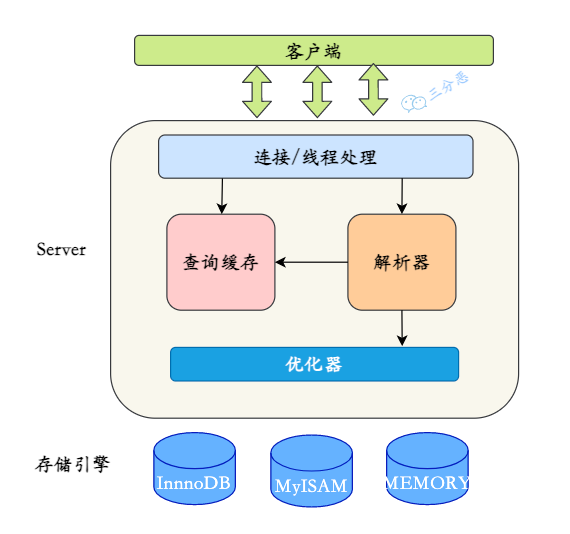
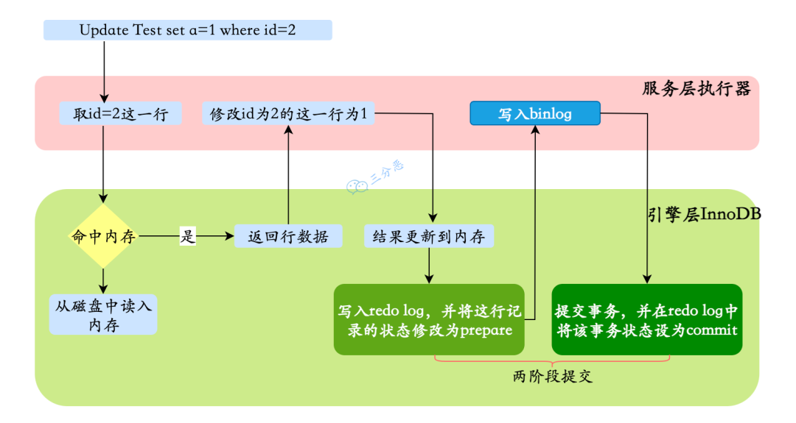

## 说说 MySQL 的基础架构
连接层，服务层，存储层

1. 连接层主要负责客户端连接的管理，包括验证用户身份、权限校验、连接管理等。可以通过数据库连接池来提升连接的处理效率。
2. 服务层是 MySQL 的核心，主要负责查询解析、优化、执行等操作。在这一层，SQL 语句会经过解析、优化器优化，然后转发到存储引擎执行，并返回结果。这一层包含查询解析器、优化器、执行计划生成器、日志模块等。
3. 存储引擎层负责数据的实际存储和提取。MySQL 支持多种存储引擎，如 InnoDB、MyISAM、Memory 等。
## binlog写入
服务层，每一条SQL都写入
## 一条查询语句是如何执行的
第一步，客户端发送 SQL 查询语句到 MySQL 服务器。

第二步，MySQL 服务器的连接器开始处理这个请求，跟客户端建立连接、获取权限、管理连接。

第三步，解析器对 SQL 语句进行解析，检查语句是否符合 SQL 语法规则，确保数据库、表和列都是存在的，并处理 SQL 语句中的名称解析和权限验证。

第四步，优化器负责确定 SQL 语句的执行计划，这包括选择使用哪些索引，以及决定表之间的连接顺序等。

第五步，执行器会调用存储引擎的 API 来进行数据的读写。

第六步，存储引擎负责查询数据，并将执行结果返回给客户端。客户端接收到查询结果，完成这次查询请求。
## 一条更新语句是如何执行的？

在事务开始前，MySQL 需要记录undo log，用于事务回滚。
除了记录 undo log，存储引擎还会将更新操作写入 redo log，状态标记为 prepare，并确保 redo log 持久化到磁盘。这一步可以保证即使系统崩溃，数据也能通过 redo log 恢复到一致状态。
写完 redo log 后，MySQL 会获取行锁，将 a 的值修改为 1，标记为脏页，此时数据仍然在内存的 buffer pool 中，不会立即写入磁盘。后台线程会在适当的时候将脏页刷盘，以提高性能。

最后提交事务，redo log 中的记录被标记为 committed，行锁释放。

如果 MySQL 开启了 binlog，还会将更新操作记录到 binlog 中，主要用于主从复制。

以及数据恢复，可以结合 redo log 进行点对点的恢复。binlog 的写入通常发生在事务提交时，与 redo log 共同构成“两阶段提交”，确保两者的一致性。

注意，redo log 的写入有两个阶段的提交，一是 binlog 写入之前prepare 状态的写入，二是 binlog 写入之后 commit 状态的写入。、
## 说说 MySQL 的段区页行
1、段：表空间由多个段组成，常见的段有数据段、索引段、回滚段等。

创建索引时会创建两个段，数据段和索引段，数据段用来存储叶子节点中的数据；索引段用来存储非叶子节点的数据。

回滚段包含了事务执行过程中用于数据回滚的旧数据。

2、区：段由一个或多个区组成，区是一组连续的页，通常包含 64 个连续的页，也就是 1M 的数据。

使用区而非单独的页进行数据分配可以优化磁盘操作，减少磁盘寻道时间，特别是在大量数据进行读写时。

3、页：页是 InnoDB 存储数据的基本单元，标准大小为 16 KB，索引树上的一个节点就是一个页。

也就意味着数据库每次读写都是以 16 KB 为单位的，一次最少从磁盘中读取 16KB 的数据到内存，一次最少写入 16KB 的数据到磁盘。

4、行：InnoDB 采用行存储方式，意味着数据按照行进行组织和管理，行数据可能有多个格式，比如说 COMPACT、REDUNDANT、DYNAMIC 等。

MySQL 8.0 默认的行格式是 DYNAMIC，由COMPACT 演变而来，意味着这些数据如果超过了页内联存储的限制，则会被存储在溢出页中。

可以通过 show table status like '%article%' 查看行格式。