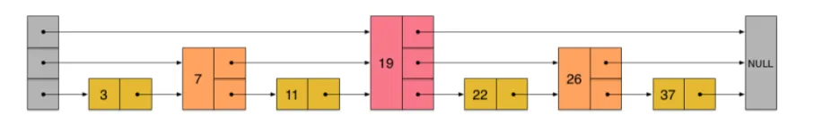

## Redis都有哪些底层数据结构？
首先是 SDS，这是 Redis 自己实现的动态字符串，它保留了 C 语言原生的字符串长度，所以获取长度的时间复杂度是 O(1)，在此基础上还支持动态扩容，以及存储二进制数据。
然后是字典，更底层是用数组+链表实现的哈希表。它的设计很巧妙，用了两个哈希表，平时用第一个，rehash 的时候用第二个，这样可以渐进式地进行扩容，不会阻塞太久。
接下来压缩列表 ziplist，这个设计很有意思。Redis 为了节省内存，设计了这种紧凑型的数据结构，把所有元素连续存储在一块内存里。但是它有个致命问题叫"连锁更新"，就是当我们修改一个元素的时候，可能会导致后面所有的元素都要重新编码，性能会急剧下降。
为了解决压缩列表的问题，Redis 后来设计了 quicklist。这个设计思路很聪明，它把 ziplist 拆分成小块，然后用双向链表把这些小块串起来。这样既保持了 ziplist 节省内存的优势，又避免了连锁更新的问题，因为每个小块的 ziplist 都不会太大。
再后来，Redis 又设计了 listpack，这个可以说是 ziplist 的完美替代品。它最大的特点是每个元素只记录自己的长度，不记录前一个元素的长度，这样就彻底解决了连锁更新的问题。Redis 5.0 已经用 listpack 替换了 ziplist。
跳表skiplist 主要用在 ZSet 中。它的设计很巧妙，通过多层指针来实现快速查找，平均时间复杂度是 O(log N)。相比红黑树，跳表的实现更简单，而且支持范围查询，这对 Redis 的有序集合来说很重要。
还有整数集合intset，当 Set 中都是整数且元素数量较少时使用，内部是一个有序数组，查找用的二分法。
最后是双向链表LinkedList，早期版本的 Redis 会在 List 中用到，但 Redis 3.2 后就被 quicklist 替代了，因为纯链表的问题是内存不连续，影响 CPU 缓存性能。
## 简单介绍下链表？
Redis 的 linkedlist 是⼀个双向⽆环链表结构，和 Java 中的 LinkedList 类似。

节点由 listNode 表示，每个节点都有指向其前置节点和后置节点的指针，头节点的前置和尾节点的后置均指向 null。
## 关于整数集合，能再详细说说吗？
整数集合是 Redis 中一个非常精巧的数据结构，当一个 Set 只包含整数元素，并且数量不多时，默认不超过 512 个，Redis 就会用 intset 来存储这些数据。
intset 最有意思的地方是类型升级机制。它有三种编码方式：16位、32位和 64位，会根据存储的整数大小动态调整。比如原来存的都是小整数，用 16 位编码就够了，但突然插入了一个很大的数，超出了 16 位的范围，这时整个数组会升级到 32 位编码。
当然了，这种升级是有代价的，因为需要重新分配内存并复制数据，并且是不可逆的，但它的好处是可以节省内存空间，特别是在存储大量小整数时。

另外，所有元素在数组中按照从小到大的顺序排列，这样就可以使用二分查找来定位元素，时间复杂度为 O(log N)。
## 说一下zset 的底层原理？
ZSet 是 Redis 最复杂的数据类型，它有两种底层实现方式：压缩列表和跳表。
当保存的元素数量少于 128 个，且保存的所有元素大小都小于 64 字节时，Redis 会采用压缩列表的编码方式；否则就用跳表。

当然，这两个条件都可以通过参数进行调整。

选择压缩列表作为底层实现时，每个元素会使用两个紧挨在一起的节点来保存：第一个节点保存元素的成员，第二个节点保存元素的分值。
所有元素按分值从小到大有序排列，小的放在靠近表头的位置，大的放在靠近表尾的位置。

但跳表的缺点是查找只能按顺序进行，时间复杂度为 O(N)，而且在最坏的情况下，插入和删除操作还可能会引起连锁更新。
当元素数量较多或元素较大时，Redis 会使用 skiplist 的编码方式；这个设计非常的巧妙，同时使用了两种数据结构：
跳表按分数有序保存所有元素，且支持范围查询（如 ZRANGE、ZRANGEBYSCORE），平均时间复杂度为 O(log N)。而哈希表则用来存储成员和分值的映射关系，查找时间复杂度为 O(1)。
虽然同时使用两种结构，但它们会通过指针来共享相同元素的成员和分值，因此不会浪费额外的内存。
## 你知道为什么Redis 7.0要用listpack来替代ziplist吗？
主要是为了解决压缩列表的一个核心问题——连锁更新。在压缩列表中，每个节点都需要记录前一个节点的长度信息。
当插入或删除一个节点时，如果这个操作导致某个节点的长度发生了变化，那么后续的节点可能都需要更新它们存储的"前一个节点长度"字段。最坏的情况下，一次操作可能触发整个链表的更新，时间复杂度会从 O(1)退化到 O(n²)。
而 listpack 的设计理念完全不同。它让每个节点只记录自己的长度信息，不再依赖前一个节点的长度。这样就从根本上避免了连锁更新的问题。
listpack 中的节点不再保存其前一个节点的长度，而是保存当前节点的编码类型、数据和长度。
## 连锁更新是怎么发生的？
比如说我们有一个压缩列表，其中有几个节点的长度都是 253 个字节。在 ziplist 的编码中，如果前一个节点的长度小于 254 字节，我们只需要 1 个字节来存储这个长度信息。
但如果在这些节点前面插入一个长度为 254 字节的节点，那么原来只需要 1 个字节存储长度的节点现在需要 5 个字节来存储长度信息。这就会导致后续所有节点的长度信息都需要更新。
## Redis 为什么不用 C 语言的原生字符串？
第一，C 语言的字符串其实就是字符数组，以 \0 结尾，这意味着如果数据本身包含 \0 字节，就会被误认为字符串结束。但 Redis 需要存储各种类型的数据，包括图片、序列化对象等二进制数据，这些数据中很可能包含 \0。
第二，如果需要获取字符串长度，C 语言只能调用 strlen() 函数，时间复杂度是 O(N)，因为要遍历整个字符串直到遇到 \0。

第三，C 语言的字符串不会自动检查边界，如果往一个字符数组里写入超过其容量的数据，就会出现缓冲区溢出。
第四，C 语言的字符串不支持动态扩容，如果需要修改内容，就必须重新分配内存并复制数据，开销很大。
Redis 设计的 SDS 完美解决了这些问题，获取长度可以直接通过 len 字段，时间复杂度为 O(1)；free 字段会记录剩余空间，因此 Redis 可以根据预分配策略动态扩容，不用在追加数据时重新分配内存；并且不依赖于 \0 结尾，可以存储任意二进制数据。
## 你研究过 Redis 的字典源码吗？
是的，有研究过。Redis 的字典分为三层，最外层是一个 dict 结构，包含两个哈希表 ht[0] 和 ht[1]，用于存储键值对。每个哈希表由一个数组和链表组成，数组用于快速定位，链表用于解决哈希冲突。
字典最核心的特点是渐进式 rehash，这是我觉得最精彩的部分。传统的哈希表扩容都是一次性完成的，但 Redis 不是这样的。

当负载因子触发 rehash 条件时，Redis 会为哈希表1 分配新的空间，通常是哈希表 0 的两倍大小，然后将 rehashidx 设置为 0。
接下来的关键是，Redis 不会一次性把所有数据从哈希表0 迁移到哈希表1，而是每次操作字典时，顺便迁移哈希表0 中 rehashidx 位置上的所有键值对。迁移完一个槽位后，rehashidx 递增，直到整个哈希表0 迁移完毕。
这种设计的巧妙之处在于把 rehash 的开销分摊到了每次操作中。假设有一个几百万键的哈希表，如果一次性 rehash 可能需要几百毫秒，这对单线程的 Redis 来说是灾难性的。但通过渐进式 rehash，每次操作只增加很少的额外开销，用户基本感觉不到延迟。
在 rehash 期间，查找操作会先查 哈希表 0，没找到再查哈希表 1；但是新插入的数据只会放到哈希表 1 中。这样既可以保证数据的完整性，又能避免数据的重复。
## 遇到哈希冲突怎么办？
Redis 是通过链地址法来解决哈希冲突的，每个哈希表的槽位实际上是一个链表的头指针，当多个键的哈希值映射到同一个槽位时，这些键会以链表的形式串联起来。
具体实现上，Redis 会通过哈希表节点的 next 指针，指向下一个具有相同哈希值的节点。当发生冲突时，新的键值对会插入到链表的头部，时间复杂度是 O(1)。查找时需要遍历整个链表，最坏的情况下时间复杂度为 O(n)，但通常链表都比较短。
另外，Redis 设计的哈希函数在分布上也比较均匀，能够有效减少哈希冲突的发生。
## 你了解跳表吗？
跳表是一种非常巧妙的数据结构，它在有序链表的基础上建立了多层索引，最底层包含所有数据，每往上一层，节点数量就减少一半。

它的核心思想是"用空间换时间"，通过多层索引来跳过大量节点，从而提高查找效率。
每个节点有 50% 的概率只在第 1 层出现，25% 的概率在第 2 层出现，依此类推。查找的时候从最高层开始水平移动，当下一个节点值大于目标时，就向下跳一层，直到找到目标节点
## 怎么往跳表插入节点呢？
首先是找到插入位置，从最高层的头节点开始，在每一层都找到应该插入位置的前驱节点，用一个 update 数组把这些前驱节点记录下来。这个查找过程和普通查找一样，在每层向右移动直到下个节点的值大于要插入的值，然后下降到下一层。
接下来随机生成新节点的层数。通常用一个循环，每次有 50% 的概率继续往上，直到随机失败或达到最大层数限制。
创建新节点后，从底层开始到新节点的最高层，在每一层都进行标准的链表插入操作。这一步要利用之前记录的 update 数组，将新节点插入到正确位置，然后更新前后指针的连接关系。
## zset为什么要使用跳表呢？
第一，跳表天然就是有序的数据结构，查找、插入和删除都能保持 O(log n) 的时间复杂度。
第二，跳表支持范围查询，找到起始位置后可以直接沿着底层链表顺序遍历，满足 ZRANGE 按排名获取元素，或者 ZRANGEBYSCORE 按分值范围获取元素。
## 跳表是如何定义的呢？
跳表本质上是一个多层链表，底层是一个包含所有元素的有序链表，上一层作为索引层，包含了下一层的部分节点；层数通过随机算法确定，理论上可以无限高。
跳表节点包含分值 score、成员对象 obj、一个后退指针 backward，以及一个层级数组 level。每个层级包含 forward 前进指针和 span 跨度信息。
跳表本身包含头尾节点指针、节点总数 length 和当前最大层数 level。
## span 跨度有什么用？
span 跨度有什么用？
span 记录了当前节点到下一节点之间，底层到底跨越了几个节点，它的主要作用是快速找到 ZSet 中某个分值的排名。
比如说我们执行 ZRANK 命令时，如果没有 span，就需要从头节点开始遍历每个节点，直到找到目标分值，这样时间复杂度是 O(n)。
但有了 span，我们在从高层往低层搜索的时候，可以直接跳过一些节点，快速定位到目标分值所在的范围。这样就能把时间复杂度降到 O(log n)。
## 为什么跳表的范围查询效率比字典高？
字典是通过哈希函数将键值对分散存储的，元素在内存中是无序分布的，没有任何顺序关系。而跳表本身就是有序的数据结构，所有元素按照分值从小到大排列。
当需要进行范围查询时，字典必须遍历所有元素，逐个检查每个元素是否在指定范围内，时间复杂度是 O(n)。比如要找分值在 60 到 80 之间的所有元素，字典只能把整个哈希表扫描一遍，因为它无法知道符合条件的元素在哪里。
而跳表的范围查询就高效多了。首先用 O(log n) 时间找到范围的起始位置，然后沿着底层的有序链表顺序遍历，直到超出范围为止。总时间复杂度是 O(log n + k)，其中 k 是结果集的大小。这种效率差异在数据量大的时候非常明显。
这也是为什么 Redis 的 zset 要用跳表而不是纯哈希表的重要原因，因为 zset 经常需要 ZRANGE、ZRANGEBYSCORE 这类范围操作。实际上 Redis 的 zset 是跳表和哈希表的组合：跳表保证有序性支持范围查询，哈希表保证 O(1) 的单点查找效率，两者互补。
## 压缩列表了解吗？
压缩列表是 Redis 为了节省内存而设计的一种紧凑型数据结构，它会把所有数据连续存储在一块内存当中。

整个结构包含头部信息，如总的字节数、尾部偏移量、节点数量，以及连续的节点数据。
当 list、hash 和 set 的数据量较小且值都不大时，底层会使用压缩列表来实现。
通常情况在，每个节点包含三个前一个节点的长度是为了支持从后往前遍历；当前一个节点的长度小于 254 字节时，使用 1 字节存储；否则用 5 字节存储，第一个字节设置为 254，后四个字节存储实际长度。
部分：前一个节点的长度、编码类型和实际的数据。
编码类型会根据数据的实际情况选择最紧凑的存储方式。
但压缩列表有个致命问题，就是连锁更新。当插入或删除节点导致某个节点长度发生变化时，可能会影响后续所有节点存储的“前一个节点长度”字段，最坏情况下时间复杂度会退化到 O(n²)。
## ziplist 的节点数量会超过 65535 吗？
不会。

Zllen 字段的类型是 uint16_t，最大值为 65535，也就是 2 的 16次方，所以压缩列表的节点数量不会超过 65535。

当节点数量小于 65535 时，该字段会存储实际的数量；否则该字段就固定为 65535，实际存储的数量需要逐个遍历节点来计算。
## ziplist 的编码类型了解多少？
ziplist 的编码类型设计得很精巧，主要分为字符串编码和整数编码两大类，目的是用最少的字节存储数据。

比如 0 到 12 这些小整数直接编码在 type 字段中，只需要 1 个字节。
| 编码 | 长度 | 描述 |
|---|---|---|
| `11000000` | 1字节 | `int16_t` 类型整数，2 字节 |
| `11010000` | 1字节 | `int32_t` 类型整数，4 字节 |
| `11100000` | 1字节 | `int64_t` 类型整数，8 字节 |
| `11110000` | 1字节 | 24位有符号整数，3 字节 |
| `1111xxxx` | 1字节 | 数据范围在 `[0-12]`，数据包含在编码中 |
对于字符串编码，根据字符串长度有三种格式。长度小于 63 字节的用 00 开头的单字节编码，剩余 6 位存储长度。长度在 63 到 16383 之间的用 01 开头的双字节编码，剩余 14 位存储长度。超过 16383 字节的用 10 开头，后面跟 4 字节存储长度。
| 编码 | 长度 | 描述 |
|---|---|---|
| `00pppppp` | 1字节 | `0-63` 字节的字符串 |
| `01pppppp qqqqqqqq` | 2字节 | `64-16383` 字节的字符串 |
| `10______ qqqqqqqq rrrrrrrr ssssssss tttttttt` | 5字节 | `16384-4294967295` 字节的字符串 |
## quicklist 了解吗？
quicklist 是 Redis 在 3.2 版本时引入的，专门用于 List 的底层实现，它实际上是一个混合型数据结构，结合了压缩列表和双向链表的优点。
在早期的版本中，List 会根据元素的数量和大小采用两种不同的底层数据结构，当元素较少或者较小时，会使用压缩列表；否则用双向链表。

但这种设计有个问题，就是当 List 中的元素数量较多时，压缩列表会因为连锁更新导致性能下降，而双向链表又会占用更多内存。

quicklist 通过将 List 拆分为多个小的 ziplist，再通过指针链接成一个双向链表，巧妙的解决了这个问题。
默认情况下，每个 ziplist 可以存储 8KB 的数据，假如每个元素的大小恰好是 1KB，那么一个 quicklist 就可以存储 8 个元素。80 个这样的元素就会被分成 10 个 ziplist。

这样既保留了压缩列表的内存紧凑性，又减少了双向链表指针的数量，进一步降低了内存开销。
除此之外，quicklist 还有一个重要的特性，就是它的可配置性，可以通过填充因子控制每个 ziplist 节点的大小。当填充因子为正数时，它还可以限制每个 ziplist 最多包含的元素数量。
如果想进一步节省内存，quicklist 还支持对中间节点进行 LZF 压缩，压缩深度为 1 时，表示除了首尾各 1 个节点不压缩外，其他节点都压缩。
## LZF 压缩算法了解吗？
LZF 是一种快速的无损压缩算法，主要用于减少数据存储空间。它的核心思想是通过查找重复数据来实现压缩，通过一个滑动窗口来查找重复的字节序列，并将这些序列替换为更短的引用。
