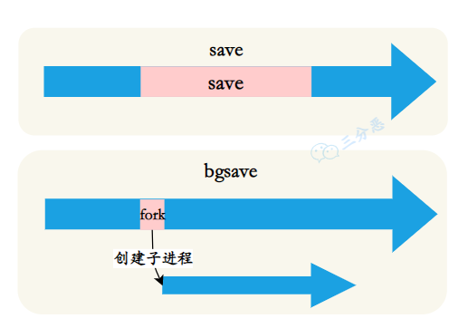

## Redis的持久化方式有哪些？
RDB 和 AOF，RDB 通过创建时间点快照来实现持久化，AOF 通过记录每个写操作命令来实现持久化。
这两种方式可以单独使用，也可以同时使用。这样就可以保证 Redis 服务器在重启后不丢失数据，通过 RDB 和 AOF 文件来恢复内存中原有的数据。
## 详细说一下 RDB？
RDB 持久化机制可以在指定的时间间隔内将 Redis 某一时刻的数据保存到磁盘上的 RDB 文件中，当 Redis 重启时，可以通过加载这个 RDB 文件来恢复数据。
RDB 持久化可以通过 save 和 bgsave 命令手动触发，也可以通过配置文件中的 save 指令自动触发。

一个阻塞，一个fork子进程
## 什么情况下会自动触发 RDB 持久化？
第一种，在 Redis 配置文件中设置 RDB 持久化参数 save <seconds> <changes>，表示在指定时间间隔内，如果有指定数量的键发生变化，就会自动触发 RDB 持久化。
第二种，主从复制时，当从节点第一次连接到主节点时，主节点会自动执行 bgsave 生成 RDB 文件，并将其发送给从节点。
## 详细说一下 AOF？
AOF 通过记录每个写操作命令，并将其追加到 AOF 文件来实现持久化，Redis 服务器宕机后可以通过重新执行这些命令来恢复数据。
当 Redis 执行写操作时，会将写命令追加到 AOF 缓冲区；Redis 会根据同步策略将缓冲区的数据写入到 AOF 文件。
当 AOF 文件过大时，Redis 会自动进行 AOF 重写，剔除多余的命令，比如说多次对同一个 key 的 set 和 del，生成一个新的 AOF 文件；当 Redis 重启时，读取 AOF 文件中的命令并重新执行，以恢复数据。
## AOF 的刷盘策略了解吗？
Redis 将 AOF 缓冲区的数据写入到 AOF 文件时，涉及两个系统调用：write 将数据写入到操作系统的缓冲区，fsync 将 OS 缓冲区的数据刷新到磁盘。

这里的刷盘涉及到三种策略：always、everysec 和 no。
>always：每次写命令执行完，立即调用 fsync 同步到磁盘，这样可以保证数据不丢失，但性能较差。
>everysec：每秒调用一次 fsync，将多条命令一次性同步到磁盘，性能较好，数据丢失的时间窗口为 1 秒。
>no：不主动调用 fsync，由操作系统决定，性能最好，但数据丢失的时间窗口不确定，依赖于操作系统的缓存策略，可能会丢失大量数据
## 说说AOF的重写机制？
由于 AOF 文件会随着写操作的增加而不断增长，为了解决这个问题， Redis 提供了重写机制来对 AOF 文件进行压缩和优化。
AOF 重写可以通过两种方式触发，第一种是手动执行 BGREWRITEAOF 命令，适用于需要立即减小AOF文件大小的场景。

第二种是在 Redis 配置文件中设置自动重写参数，比如说 auto-aof-rewrite-percentage 和 auto-aof-rewrite-min-size，表示当 AOF 文件大小超过指定值时，自动触发重写。
## AOF 重写的具体过程是怎样的？
Redis 在收到重写指令后，会创建一个子进程，并 fork 一份与父进程完全相同的数据副本，然后遍历内存中的所有键值对，生成重建它们所需的最少命令。
AOF 重写期间，Redis 服务器会处于特殊状态：

aof_child_pid 不为 0，表示有子进程在执行 AOF 重写
aof_rewrite_buf_blocks 链表不为空，存储 AOF 重写缓冲区内容
如果在配置文件中设置 no-appendfsync-on-rewrite 为 yes，那么重写期间可能会暂停 AOF 文件的 fsync 操作。
## Aof存储的什么文件
AOF 文件存储的是 Redis 服务器接收到的写命令数据，以 Redis 协议格式保存。

这种格式的特点是，每个命令以*开头，后跟参数的数量，每个参数前用$符号，后跟参数字节长度，然后是参数的实际内容。
```shell
*3
$3
SET
$4
name
$3
hdz
```
## AOF重写期间命令可能会写入两次，会造成什么影响？
AOF 重写期间命令会同时写入现有AOF文件和重写缓冲区，这种机制是有意设计的，并不会导致数据重复或不一致问题。
## RDB 和 AOF 各自有什么优缺点？
RDB 通过 fork 子进程在特定时间点对内存数据进行全量备份，生成二进制格式的快照文件。其最大优势在于备份恢复效率高，文件紧凑，恢复速度快，适合大规模数据的备份和迁移场景。

缺点是可能丢失两次快照期间的所有数据变更。
AOF 会记录每一条修改数据的写命令。这种日志追加的方式让 AOF 能够提供接近实时的数据备份，数据丢失风险可以控制在 1 秒内甚至完全避免。

缺点是文件体积较大，恢复速度慢。
## RDB 和 AOF 如何选择？
在选择 Redis 持久化方案时，我会从业务需求和技术特性两个维度来考虑。

如果是缓存场景，可以接受一定程度的数据丢失，我会倾向于选择 RDB 或者完全不使用持久化。RDB 的快照方式对性能影响小，而且恢复速度快，非常适合这类场景。
但如果是处理订单或者支付这样的核心业务，数据丢失将造成严重后果，那么 AOF 就成为必然选择。通过配置每秒同步一次，可以将潜在的数据丢失风险限制在可接受范围内。
在实际的项目当中，我更偏向于使用 RDB + AOF 的混合模式。
```shell
appendonly yes #开启AOF
appendfsync everysec # 每秒刷盘一次
aof-use-rdb-preamble yes # 开启混合持久化，重启时优先加载 RDB，RDB 作为冷备，AOF 作为实时同步
```
## Redis如何恢复数据？
当 Redis 服务重启时，它会优先查找 AOF 文件，如果存在就通过重放其中的命令来恢复数据；如果不存在或未启用 AOF，则会尝试加载 RDB 文件，直接将二进制数据载入内存来恢复。
如果 AOF 文件损坏的话，Redis 会尝试通过 redis-check-aof 工具来修复 AOF 文件，或者直接使用 --repair 参数来修复。
虽然 Redis 还提供了 redis-check-rdb 工具来检查 RDB 文件的完整性，但它并不支持修复 RDB 文件，只能用来验证文件的完整性。
## Redis 4.0 的混合持久化了解吗？
是的。

混合持久化结合了 RDB 和 AOF 两种方式的优点，解决了它们各自的不足。在 Redis 4.0 之前，我们要么面临 RDB 可能丢失数据的风险，要么承受 AOF 恢复慢的问题，很难两全其美。
混合持久化的工作原理非常巧妙：在 AOF 重写期间，先以 RDB 格式将内存中的数据快照保存到 AOF 文件的开头，再将重写期间的命令以 AOF 格式追加到文件末尾。
这样，当需要恢复数据时，Redis 先加载 RDB 格式的数据来快速恢复大部分的数据，然后通过重放命令恢复最近的数据，这样就能在保证数据完整性的同时，提升恢复速度。
## 如何设置持久化模式？
```shell
aof-use-rdb-preamble yes
```
## 你在开发中是怎么配置 RDB 和 AOF 的？
对于大多数生产环境，我倾向于使用混合持久化方式，结合 RDB 和 AOF 的优点。
对于单纯的缓存场景，或者本地开发，我会只启用 RDB，关闭 AOF。
而对于金融类等高一致性的系统，我通常会在关键时间窗口动态将 appendfsync 设置为 always：
另外，对于高并发场景，应该设置no-appendfsync-on-rewrite yes，避免 AOF 重写影响主进程性能；对于大型实例，也应该设置 rdb-save-incremental-fsync yes 来减少大型 RDB 保存对性能的影响。


