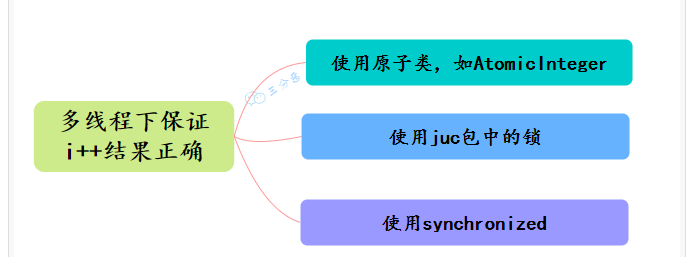
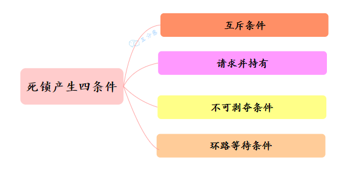

## synchronized 用过吗？
用过，频率还很高。

synchronized 在 JDK 1.6 之后，进行了锁优化，增加了偏向锁、轻量级锁，大大提升了 synchronized 的性能。
### synchronized 上锁的对象是什么？
synchronized 用在普通方法上时，上锁的是执行这个方法的对象。
```java
public synchronized void increment {
    this.count++;
}
```
synchronized 用在静态方法上时，上锁的是这个类的 Class 对象。
```java
public static synchronized void increment {
    this.count++;
}
```
synchronized 用在代码块上时，上锁的是括号中指定的对象，比如说当前对象 this。
```java
public void increment() {
    synchronized (this) {
        this.count++;
    }
}
```
## synchronized 的实现原理了解吗？
synchronized 依赖 JVM 内部的 Monitor 对象来实现线程同步。使用的时候不用手动去 lock 和 unlock，JVM 会自动加锁和解锁。

synchronized 加锁代码块时，JVM 会通过 monitorenter、monitorexit 两个指令来实现同步：
- 前者表示线程正在尝试获取 lock 对象的 Monitor；
- 后者表示线程执行完了同步代码块，正在释放锁。
使用 javap -c -s -v -l SynchronizedDemo.class 反编译 synchronized 代码块时，就能看到这两个指令。
synchronized 修饰普通方法时，JVM 会通过 ACC_SYNCHRONIZED 标记符来实现同步。
## 你对 Monitor 了解多少？
Monitor 是 JVM 内置的同步机制，每个对象在内存中都有一个对象头——Mark Word，用于存储锁的状态，以及 Monitor 对象的指针。
synchronized 依赖对象头的 Mark Word 进行状态管理，支持无锁、偏向锁、轻量级锁，以及重量级锁。

在 Hotspot 虚拟机中，Monitor 由 ObjectMonitor 实现：
_owner：当前持有 ObjectMonitor 的线程，初始值为 null，表示没有线程持有锁。线程成功获取锁后，该值更新为线程 ID，释放锁后重置为 null。
_count：记录当前线程获取锁的次数（可重入锁），每次成功加锁 _count + 1，释放锁 _count - 1。
_WaitSet：等待队列，调用 wait() 方法后，线程会释放锁，并加入 _WaitSet，进入 WAITING 状态，等待 notify() 唤醒。
_cxq：阻塞队列，用于存放刚进入 Monitor 的线程（还未进入 _EntryList）。
_EntryList：竞争队列，所有等待获取锁的线程（BLOCKED 状态）会进入 _EntryList，等待锁释放后竞争执行权。
## 会不会牵扯到 os 层面呢？
会，synchronized 升级为重量级锁时，依赖于操作系统的互斥量——mutex 来实现，mutex 用于保证任何给定时间内，只有一个线程可以执行某一段特定的代码段。
## synchronized 怎么保证可见性？
加锁时，线程必须从主内存读取最新数据。
释放锁时，线程必须将修改的数据刷回主内存，这样其他线程获取锁后，就能看到最新的数据。
## synchronized 怎么实现可重入的呢？
可重入意味着同一个线程可以多次获得同一个锁，而不会被阻塞。
synchronized 之所以支持可重入，是因为 Java 的对象头包含了一个 Mark Word，用于存储对象的状态，包括锁信息。

当一个线程获取对象锁时，JVM 会将该线程的 ID 写入 Mark Word，并将锁计数器设为 1。

如果一个线程尝试再次获取已经持有的锁，JVM 会检查 Mark Word 中的线程 ID。如果 ID 匹配，表示的是同一个线程，锁计数器递增。
当线程退出同步块时，锁计数器递减。如果计数器值为零，JVM 将锁标记为未持有状态，并清除线程 ID 信息。
因为 synchronized 支持可重入，所以 method1 获取锁后，method2 仍然可以获取锁。

底层是通过 Monitor 对象的 owner 和 count 字段实现的，owner 记录持有锁的线程，count 记录线程获取锁的次数。
## synchronized 锁升级了解吗？
没有线程竞争时，就使用低开销的“偏向锁”，此时没有额外的 CAS 操作；轻度竞争时，使用“轻量级锁”，采用 CAS 自旋，避免线程阻塞；只有在重度竞争时，才使用“重量级锁”，由 Monitor 机制实现，需要线程阻塞
## 了解 synchronized 四种锁状态吗？
1. 无锁状态，对象未被锁定，Mark Word 存储对象的哈希码等信息。
2. 偏向锁，当线程第一次获取锁时，会进入偏向模式。Mark Word 会记录线程 ID，后续同一线程再次获取锁时，可以直接进入 synchronized 加锁的代码，无需额外加锁。
3. 轻量级锁，当多个线程在不同时段获取同一把锁，即不存在锁竞争的情况时，JVM 会采用轻量级锁来避免线程阻塞。未持有锁的线程通过CAS 自旋等待锁释放。当线程进入 synchronized 加锁的代码时，如果对象的锁状态为偏向锁，也就是锁类型为“01”，偏向锁标记为“0”的状态。然后采用 CAS 自旋的方式，尝试将对象头中的 Mark Word 替换为指向 Lock Record 的指针，并将 Lock Record 中的 owner 指针指向对象的 Mark Word。如果这个替换动作成功了，线程就拥有了该对象的锁，对象头 Mark Word 的锁标志位会更新为“00”，表示对象处于轻量级锁状态。
4.重量级锁，如果自旋超过一定的次数，或者一个线程持有锁，一个自旋，又有第三个线程进入 synchronized 加锁的代码时，轻量级锁就会升级为重量级锁。
此时，对象头的锁类型会更新为“10”，Mark Word 会存储指向 Monitor 对象的指针，其他等待锁的线程都会进入阻塞状态。
## synchronized 做了哪些优化？
synchronized 是直接调用 ObjectMonitor 的 enter 和 exit 指令实现的，这种锁也被称为重量级锁，性能较差。

随着 JDK 版本的更新，synchronized 的性能得到了极大的优化：

①、偏向锁：同一个线程可以多次获取同一把锁，无需重复加锁。

②、轻量级锁：当没有线程竞争时，通过 CAS 自旋等待锁，避免直接进入阻塞。

③、锁消除：JIT 可以在运行时进行代码分析，如果发现某些锁操作不可能被多个线程同时访问，就会对这些锁进行消除，从而减少上锁开销。
## 请详细说说锁升级的过程？
①、偏向锁：当一个线程第一次获取锁时，JVM 会在对象头的 Mark Word 记录这个线程 ID，下次进入 synchronized 时，如果还是同一个线程，可以直接执行，无需额外加锁。

②、轻量级锁：当多个线程尝试获取锁但不是同一个时段，偏向锁会升级为轻量级锁，等待锁的线程通过 CAS 自旋避免进入阻塞状态。

③、重量级锁：如果自旋失败，锁会升级为重量级锁，等待锁的线程会进入阻塞状态，等待监视器 Monitor 进行调度。
## synchronized 和 ReentrantLock 的区别了解吗？
synchronized 由 JVM 内部的 Monitor 机制实现，ReentrantLock基于 AQS 实现。

synchronized 可以自动加锁和解锁，ReentrantLock 需要手动 lock() 和 unlock()。
>ReentrantLock 可以实现多路选择通知，绑定多个 Condition，而 synchronized 只能通过 wait 和 notify 唤醒，属于单路通知
```java
ReentrantLock lock = new ReentrantLock();
Condition condition = lock.newCondition();
```
synchronized 可以在方法和代码块上加锁，ReentrantLock 只能在代码块上加锁，但可以指定是公平锁还是非公平锁。
```java
// synchronized 修饰方法
public synchronized void method() {
    // 业务代码
}

// synchronized 修饰代码块
synchronized (this) {
    // 业务代码
}

// ReentrantLock 加锁
ReentrantLock lock = new ReentrantLock();
lock.lock();
try {
    // 业务代码
} finally {
    lock.unlock();
}
```
>ReentrantLock 提供了一种能够中断等待锁的线程机制，通过 lock.lockInterruptibly() 来实现。
```java
ReentrantLock lock = new ReentrantLock();
try {
    lock.lockInterruptibly();
} catch (InterruptedException e) {
    // 处理中断异常
}
```
## 并发量大的情况下，使用 synchronized 还是 ReentrantLock？
我更倾向于 ReentrantLock，因为：

- ReentrantLock 提供了超时和公平锁等特性，可以应对更复杂的并发场景。
- ReentrantLock 允许更细粒度的锁控制，能有效减少锁竞争。
- ReentrantLock 支持条件变量 Condition，可以实现比 synchronized 更友好的线程间通信机制。
## Lock 了解吗？
Lock 是 JUC 中的一个接口，最常用的实现类包括可重入锁 ReentrantLock、读写锁 ReentrantReadWriteLock 等。
## ReentrantLock 的 lock() 方法实现逻辑了解吗？
lock 方法的具体实现由 ReentrantLock 内部的 Sync 类来实现，涉及到线程的自旋、阻塞队列、CAS、AQS 等。
lock 方法会首先尝试通过 CAS 来获取锁。如果当前锁没有被持有，会将锁状态设置为 1，表示锁已被占用。否则，会将当前线程加入到 AQS 的等待队列中。
## AQS 了解多少？
AQS 是一个抽象类，它维护了一个共享变量 state 和一个线程等待队列，为 ReentrantLock 等类提供底层支持。
AQS 的思想是，如果被请求的共享资源处于空闲状态，则当前线程成功获取锁；否则，将当前线程加入到等待队列中，当其他线程释放锁时，从等待队列中挑选一个线程，把锁分配给它。
## AQS 的源码阅读过吗？
第一，状态 state 由 volatile 变量修饰，用于保证多线程之间的可见性；
2. 同步队列由内部定义的 Node 类实现，每个 Node 包含了等待状态、前后节点、线程的引用等，是一个先进先出的双向链表。
AQS 支持两种同步方式：

- 独占模式下：每次只能有一个线程持有锁，例如 ReentrantLock。
- 共享模式下：多个线程可以同时获取锁，例如 Semaphore 和 CountDownLatch。
核心方法包括：

- acquire：获取锁，失败进入等待队列；
- release：释放锁，唤醒等待队列中的线程；
- acquireShared：共享模式获取锁；
- releaseShared：共享模式释放锁。
AQS 使用一个 CLH 队列来维护等待线程，CLH 是三个作者 Craig、Landin 和 Hagersten 的首字母缩写，是一种基于链表的自旋锁
在 CLH 中，当一个线程尝试获取锁失败后，会被添加到队列的尾部并自旋，等待前一个节点的线程释放锁。
CLH 的优点是，假设有 100 个线程在等待锁，锁释放之后，只会通知队列中的第一个线程去竞争锁。避免同时唤醒大量线程，浪费 CPU 资源。
## 说说 ReentrantLock 的实现原理？
ReentrantLock 是基于 AQS 实现的 可重入排他锁，使用 CAS 尝试获取锁，失败的话，会进入 CLH 阻塞队列，支持公平锁、非公平锁，可以中断、超时等待。
内部通过一个计数器 state 来跟踪锁的状态和持有次数。当线程调用 lock() 方法获取锁时，ReentrantLock 会检查 state 的值，如果为 0，通过 CAS 修改为 1，表示成功加锁。否则根据当前线程的公平性策略，加入到等待队列中。

线程首次获取锁时，state 值设为 1；如果同一个线程再次获取锁时，state 加 1；每释放一次锁，state 减 1。
当线程调用 unlock() 方法时，ReentrantLock 会将持有锁的 state 减 1，如果 state = 0，则释放锁，并唤醒等待队列中的线程来竞争锁。
## ReentrantLock 怎么创建公平锁？
很简单，创建 ReentrantLock 的时候，传递参数 true 就可以了
```java
ReentrantLock lock = new ReentrantLock(true);
// true 代表公平锁，false 代表非公平锁
public ReentrantLock(boolean fair) {
    sync = fair ? new FairSync() : new NonfairSync();
}
```
## 怎么创建一个非公平锁呢？
创建 ReentrantLock 时，不传递参数或者传递参数就好了。
## 非公平锁和公平锁有什么不同？
公平锁意味着在多个线程竞争锁时，获取锁的顺序与线程请求锁的顺序相同，即先来先服务。

非公平锁不保证线程获取锁的顺序，当锁被释放时，任何请求锁的线程都有机会获取锁，而不是按照请求的顺序。
## 公平锁的实现逻辑了解吗？
公平锁的核心逻辑在 AQS 的 hasQueuedPredecessors() 方法中，该方法用于判断当前线程前面是否有等待的线程。如果队列前面有等待线程，当前线程就不能抢占锁，必须按照队列顺序排队。如果队列前面没有线程，或者当前线程是队列头部的线程，就可以获取锁。
## CAS 了解多少？
CAS 是一种乐观锁，用于比较一个变量的当前值是否等于预期值，如果相等，则更新值，否则重试。
在 CAS 中，有三个值：

V：要更新的变量(var)
E：预期值(expected)
N：新值(new)
先判断 V 是否等于 E，如果等于，将 V 的值设置为 N；如果不等，说明已经有其它线程更新了 V，当前线程就放弃更新。

这个比较和替换的操作需要是原子的，不可中断的。Java 中的 CAS 是由 Unsafe 类实现的。

## 怎么保证 CAS 的原子性？
CPU 会发出一个 LOCK 指令进行总线锁定，阻止其他处理器对内存地址进行操作，直到当前指令执行完成。
## CAS 有什么问题？
CAS 存在三个经典问题，ABA 问题、自旋开销大、只能操作一个变量等。
### 什么是 ABA 问题？
ABA 问题指的是，一个值原来是 A，后来被改为 B，再后来又被改回 A，这时 CAS 会误认为这个值没有发生变化。
可以使用版本号/时间戳的方式来解决 ABA 问题。

比如说，每次变量更新时，不仅更新变量的值，还更新一个版本号。CAS 操作时，不仅比较变量的值，还比较版本号。
### 自旋开销大怎么解决？
CAS 失败时会不断自旋重试，如果一直不成功，会给 CPU 带来非常大的执行开销。

可以加一个自旋次数的限制，超过一定次数，就切换到 synchronized 挂起线程。
### 涉及到多个变量同时更新怎么办？
可以将多个变量封装为一个对象，使用 AtomicReference 进行 CAS 更新。
## Java 有哪些保证原子性的方法？

## 原子操作类了解多少？
原子操作类是基于 CAS + volatile 实现的，底层依赖于 Unsafe 类，最常用的有 AtomicInteger、AtomicLong、AtomicReference 等。
像 AtomicIntegerArray 这种以 Array 结尾的，还可以原子更新数组里的元素。
像 AtomicStampedReference 还可以通过版本号的方式解决 CAS 中的 ABA 问题。
## 线程死锁了解吗？
死锁发生在多个线程相互等待对方释放锁时。比如说线程 1 持有锁 R1，等待锁 R2；线程 2 持有锁 R2，等待锁 R1。
## 死锁发生的四个条件了解吗

## 死锁问题怎么排查呢？
首先从系统级别上排查，比如说在 Linux 生产环境中，可以先使用 top ps 等命令查看进程状态，看看是否有进程占用了过多的资源。

接着，使用 JDK 自带的一些性能监控工具进行排查，比如说 使用 jps -l 查看当前进程，然后使用 jstack 进程号 查看当前进程的线程堆栈信息，看看是否有线程在等待锁资源。也可以使用一些可视化的性能监控工具，比如说 JConsole、VisualVM 等，查看线程的运行状态、锁的竞争情况等。
## 聊聊悲观锁和乐观锁
好的。

悲观锁认为每次访问共享资源时都会发生冲突，所在在操作前一定要先加锁，防止其他线程修改数据。

乐观锁认为冲突不会总是发生，所以在操作前不加锁，而是在更新数据时检查是否有其他线程修改了数据。如果发现数据被修改了，就会重试。
## 乐观锁发现有线程过来修改数据，怎么办？
可以重新读取数据，然后再尝试更新，直到成功为止或达到最大重试次数。