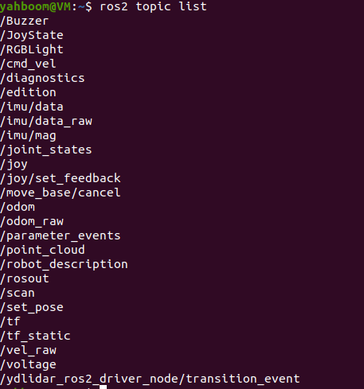
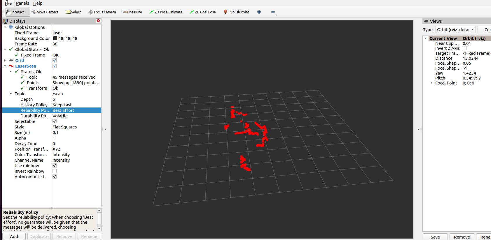

## 启动雷达
```shell
ros2 launch yahboomcar_nav laser_bringup_launch.py
```
## 确保小车与虚拟机doamin_id一样
```shell
echo $ROS_DOMAIN_ID
echo $ROS_LOCALHOST_ONLY
```

不一样就修改到一样
```shell
export ROS_DOMAIN_ID=28
```



## RVIZ配置


## 小车键盘控制
在jestson里执行
```shell
ros2 run teleop_twist_keyboard teleop_twist_keyboard --ros-args -r cmd_vel:=/cmd_vel
```
控制说明书
常用
```shell
i    前进
,    后退
j    原地左转
l    原地右转
k    停止

u    左前转弯
o    右前转弯
m    左后转弯
.    右后转弯
```
速度
```shell
q    同时增大线速度和角速度
z    同时减小线速度和角速度

w    增大线速度
x    减小线速度

e    增大角速度
c    减小角速度
```
停止
```shell
k    立即停止
Ctrl + C    退出键盘控制
```
## 摄像头启动
http://192.168.1.102:6500/video_feed端口
## 小车控制修改
• 小车键盘控制说明

  启动小车底盘后，打开一个新终端，运行键盘控制：

  ros2 run teleop_twist_keyboard teleop_twist_keyboard

  也可以使用 Yahboom 键盘控制节点：

  source /home/jetson/yahboomcar_ros2_ws/yahboomcar_ws/install/setup.bash
  ros2 run yahboomcar_ctrl yahboom_keyboard

  移动控制

  q 左前转弯    w 前进      e 右前转弯

  a 左转        空格停止    d 右转

  z 左后转弯    s 后退      x 右后转弯

  速度控制

  1  同时增大线速度和角速度
  2  同时减小线速度和角速度

  3  只增大线速度
  4  只减小线速度

  5  只增大角速度
  6  只减小角速度

  退出控制

  Ctrl + C

  注意事项

  键盘控制终端必须保持在当前激活窗口中，按键才会生效。

  如果小车没有反应，先确认底盘驱动已经启动，并检查是否有 /cmd_vel 话题：

  ros2 topic list | grep cmd_vel

  如果需要紧急停止，按：

  空格
## 虚拟机更换ip
sudo ip addr flush dev ens33
sudo ip link set ens33 up
sudo ip addr add 192.168.1.104/24 dev ens33
sudo ip route replace default via 192.168.1.1