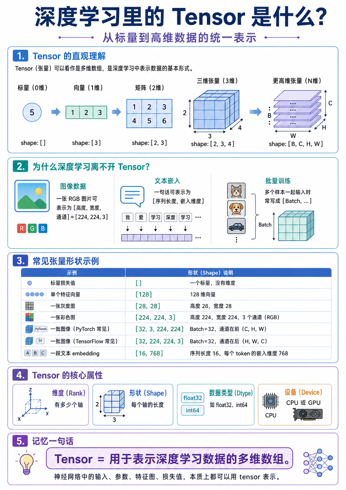

## Tensor


```python
import torch

# =========================
# 1. 创建 Tensor
# =========================

x = torch.tensor([[1, 2, 3],
                  [4, 5, 6]])

a = torch.zeros(2, 3)
b = torch.ones(2, 3)
c = torch.randn(2, 3)
d = torch.rand(2, 3)


# =========================
# 2. 查看 Tensor 属性
# =========================

x = torch.randn(4, 3, 224, 224)

shape = x.shape
dim = x.ndim
dtype = x.dtype
device = x.device
num = x.numel()


# =========================
# 3. 改变形状
# =========================

x = torch.randn(2, 3, 4)

y = x.reshape(6, 4)

z = x.view(6, 4)

f = x.flatten()

x = torch.randn(32, 3, 224, 224)
f = x.flatten(start_dim=1)


# =========================
# 4. 增加 / 删除维度
# =========================

x = torch.randn(3, 224, 224)

x1 = x.unsqueeze(0)

x2 = x1.squeeze(0)


# =========================
# 5. 维度交换
# =========================

x = torch.randn(32, 3, 224, 224)

y = x.permute(0, 2, 3, 1)

a = torch.randn(2, 3)

b = a.transpose(0, 1)


# =========================
# 6. 索引和切片
# =========================

x = torch.tensor([[1, 2, 3],
                  [4, 5, 6],
                  [7, 8, 9]])

row = x[0]

col = x[:, 0]

value = x[0, 1]

first_two_rows = x[:2, :]

cols_after_one = x[:, 1:]


# =========================
# 7. 拼接 Tensor
# =========================

a = torch.randn(2, 3)
b = torch.randn(2, 3)

c = torch.cat([a, b], dim=0)

d = torch.cat([a, b], dim=1)

e = torch.stack([a, b], dim=0)


# =========================
# 8. 数学运算
# =========================

x = torch.tensor([1.0, 2.0, 3.0])
y = torch.tensor([4.0, 5.0, 6.0])

add = x + y
sub = x - y
mul = x * y
div = x / y

sum_value = torch.sum(x)

mean_value = torch.mean(x)

max_value = torch.max(x)

min_value = torch.min(x)


# =========================
# 9. 矩阵乘法
# =========================

a = torch.randn(2, 3)
b = torch.randn(3, 4)

c = torch.matmul(a, b)

d = a @ b


# =========================
# 10. 广播机制
# =========================

x = torch.randn(2, 3)
y = torch.randn(3)

z = x + y


# =========================
# 11. 条件筛选
# =========================

x = torch.tensor([1, 2, 3, 4, 5])

mask = x > 3

y = x[mask]

z = torch.where(x > 3, x, torch.tensor(0))


# =========================
# 12. 类型转换
# =========================

x = torch.tensor([1, 2, 3])

x_float = x.float()

x_long = x.long()


# =========================
# 13. CPU / GPU 转换
# =========================

x = torch.randn(2, 3)

device = torch.device("cuda" if torch.cuda.is_available() else "cpu")

x = x.to(device)


# =========================
# 14. 去掉梯度，转 NumPy
# =========================

x = torch.randn(2, 3, requires_grad=True)

y = x.detach()

arr = y.cpu().numpy()
```
